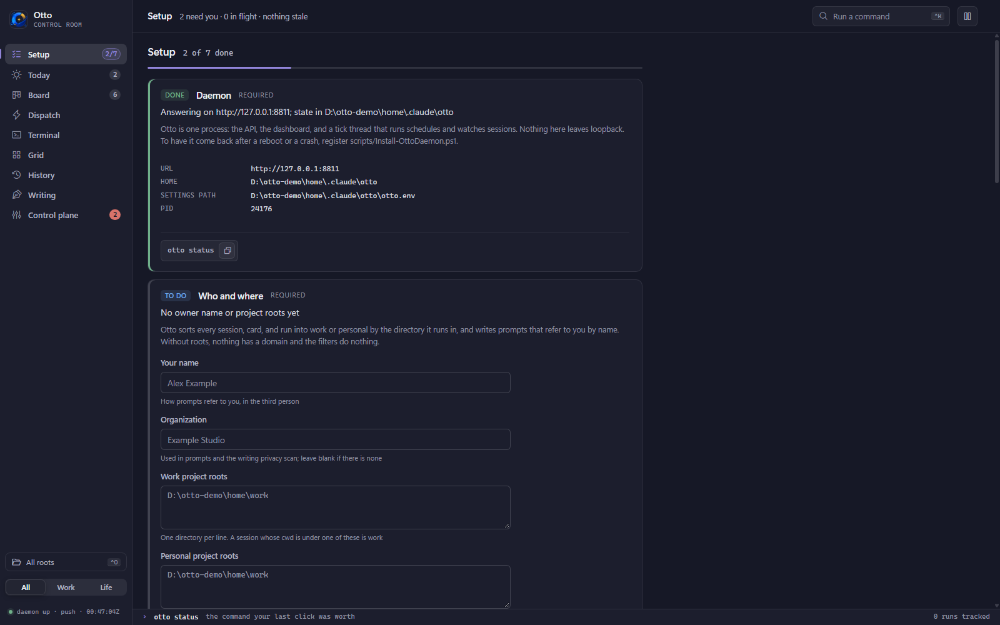
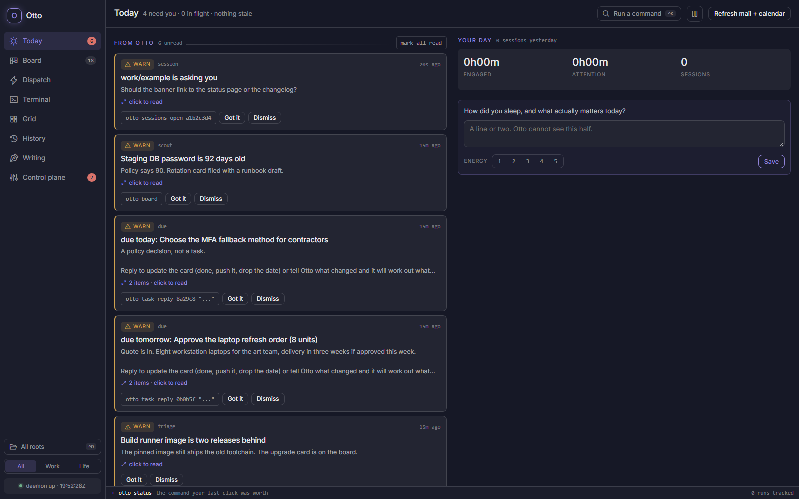
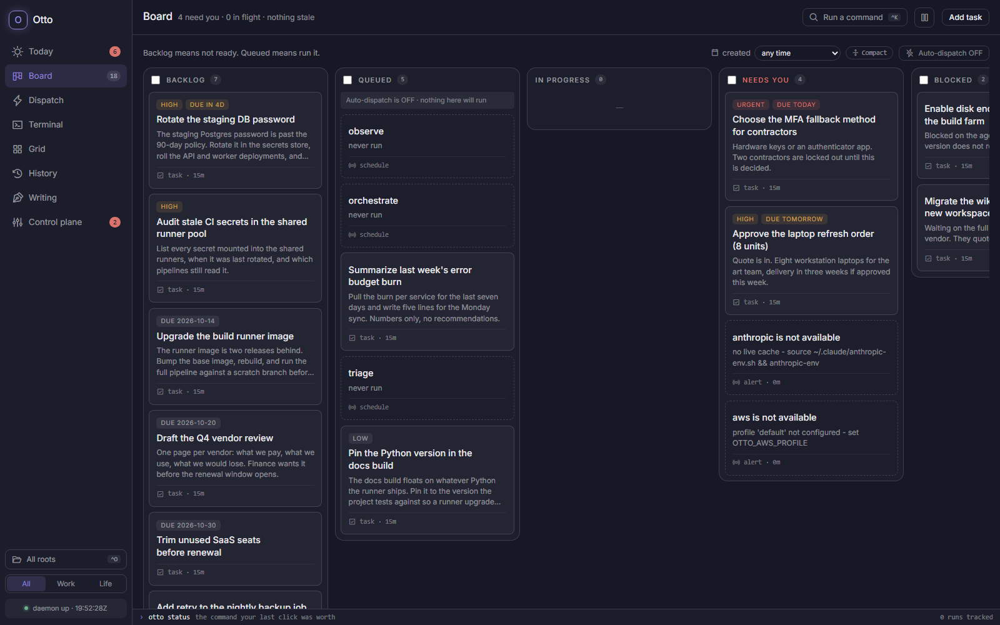
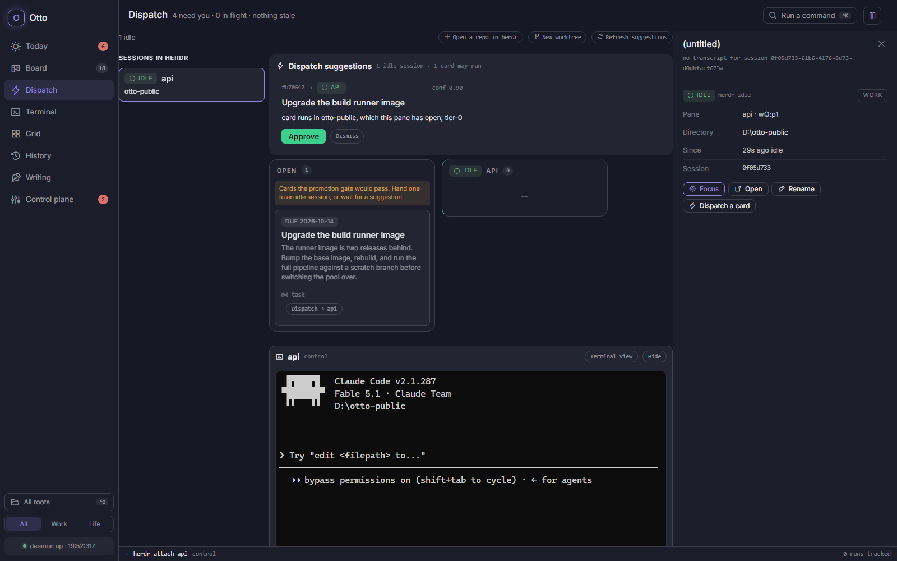
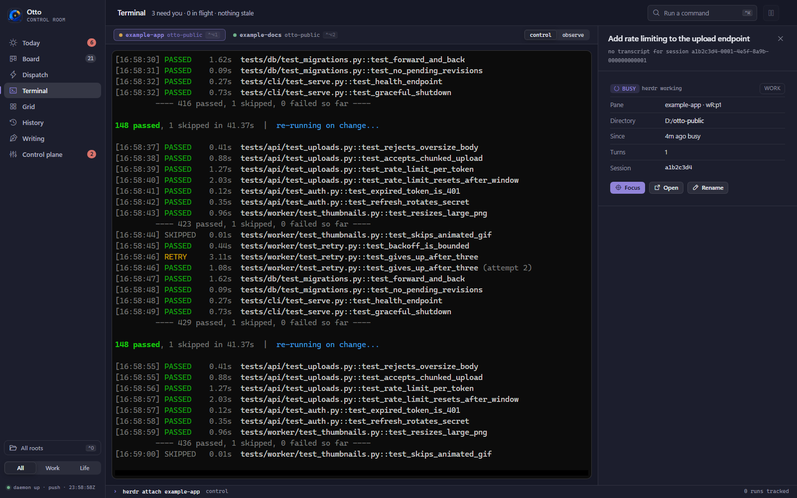
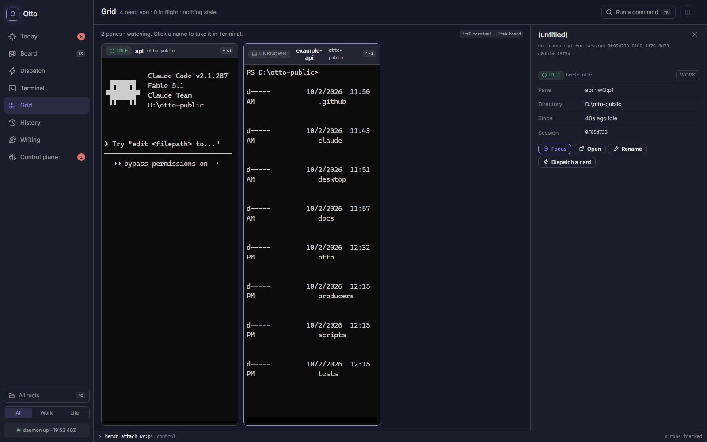

# Otto

Otto is a personal operations daemon for one person who runs many Claude Code
sessions. It keeps a board of outstanding work behind a risk-tiered promotion gate,
runs Claude Code on a schedule, tracks every live session on the machine through
Claude Code's own hooks, and puts all of it in one dashboard with a dispatch control
room. A small desktop shell wraps the dashboard in a window and a tray icon.

The problem it answers: once you have more than a handful of agent sessions, you
cannot tell by looking which ones are working, which are blocked on you, which died
quietly, and which piece of work each one is doing. Otto makes that state visible,
schedulable, and accountable, without owning the terminals the sessions run in.

## Who it is for

One person, one machine, many agents. Otto assumes you are the only operator and that
the agents are Claude Code sessions. It is not a team tool and it is not a hosted
service. Everything runs on loopback.

## Architecture

```
  browser (dashboard) ──▶ ┌────────────────────────────────────┐
  otto CLI ─────────────▶ │  daemon  127.0.0.1:8787            │
  Claude Code hooks ────▶ │  FastAPI + a tick thread           │
  agents (HTTP) ────────▶ │  single writer, atomic JSON writes │
                          └───────────────┬────────────────────┘
                                          │
                              ~/.claude/otto/state/*.json
                              ~/.claude/otto/logs/*.log

  runners/   detached    spawn and track headless Claude Code runs
             scheduled   cadence and staleness evaluation
             external    read-only liveness probes for integrations
             machine     host facts, informational only

  herdr (optional)       terminal multiplexer that owns every pane's PTY;
                         Otto reads its snapshot and dispatches into its panes
```

State is plain JSON under `~/.claude/otto` (override with `OTTO_HOME`), never in the
repo. Only the daemon writes; the CLI, the dashboard, the hooks, and agents all go
through the HTTP API. Writes are atomic (temp file, then `os.replace`), so a reader
sees the whole old file or the whole new one.

## Screenshots

Taken from a public build running against synthetic data (two scratch herdr panes, an
invented board). The dashboard is dark by default and follows a light OS theme.



**Setup**: what a fresh daemon opens on; each step read from live state, with the reason it matters, the action, and the terminal equivalent.



**Today**: what Otto has to say, what needs you now, and where yesterday went.



**Board**: every piece of outstanding work in columns; derived cards (a down integration, a schedule that never ran) sit beside the ones you filed.



**Dispatch**: the control room; live sessions on the left, suggested card-to-session pairings, the Open lane, and the selected pane's terminal.



**Terminal**: one herdr pane at full fidelity under a strip of tabs, in control or observe mode.



**Grid**: every pane tiled live in observe mode; click a name to take it in Terminal.

## Install and first run

Requirements: Python 3.13. Windows is the only platform this has been run on (see
Status below).

```
pip install -r requirements.txt
python -m otto serve            # daemon + dashboard on http://127.0.0.1:8787
```

Open the dashboard. On a fresh daemon it opens on **Setup**, a short checklist that
walks through what is worth doing, in order: who you are and where your projects
live, the Claude Code hooks (so live sessions show up), the optional herdr terminal
harness, which outside services to probe, your first card, and which of the seeded
read-only schedules to arm. Each step shows its status from live state, the plain
reason it matters, a button or form, and the equivalent terminal command. Nothing
blocks: every step can be skipped and revisited later from Control plane, System.

The same flow runs in a terminal:

```
python -m otto setup            # prompts for what is not done yet
python -m otto setup --status   # print the steps; exit 0 when complete
```

What setup writes lands in one file, `<OTTO_HOME>/otto.env` (default
`~/.claude/otto/otto.env`), in the same `KEY=value` form as `.env.example`. Values set
in the environment always win over the file. Because configuration is read when the
daemon starts, the view shows a Restart button after a change; `python -m otto restart`
does the same from a terminal.

A fresh daemon starts with every schedule disarmed: nothing runs unattended until you
say so, either in Setup or with `otto schedule arm <name>`.

If you would rather do it by hand: `python -m otto sessions install` merges six hooks
into `~/.claude/settings.json` under a marker, alongside whatever is already there,
and `sessions uninstall` removes exactly those. Note that
`~/.claude/settings.local.json` does not load hooks, which is why the user-level file
is the target. For the dispatch control room and embedded terminals, install
[herdr](https://herdr.dev), then `python -m otto herdr up` starts the server and
`python -m otto herdr open .` opens a workspace here with claude running in it.
`herdr integration install claude` adds herdr's own SessionStart hook, which reports
the Claude session id into the pane record; that id is what Otto's hooks key sessions
on, so a pane and a session are the same thing by construction.

`scripts/Install-OttoDaemon.ps1` registers a logon task and a ten-minute keepalive
(`otto ensure`) so the daemon comes back if it dies. `scripts/otto.ps1` is a
PowerShell wrapper so you can type `otto` instead of `python -m otto`.

## Configuration

Every `OTTO_*` variable is read by `otto/config.py` when the daemon starts, from the
environment first and then from `<OTTO_HOME>/otto.env` (what Setup writes). `.env.example`
documents all of them. Every organization-specific value (Slack channels,
cloud profiles, people, repositories, model names) is configuration, and the defaults
are inert: with nothing set, Otto runs the board, schedules, sessions, and dispatch
on loopback and talks to no external service.

The ones you are most likely to touch:

| Variable | What it does |
| --- | --- |
| `OTTO_HOME` | state and log directory, default `~/.claude/otto` |
| `OTTO_HOST`, `OTTO_PORT` | where the daemon listens, default `127.0.0.1:8787` |
| `OTTO_TICK` | seconds between daemon ticks, default 15 |
| `OTTO_DEFAULT_MODEL`, `OTTO_DEEP_MODEL` | which Claude Code model a dispatched card runs on; the `deep` tag selects the second |
| `OTTO_TASK_BUDGET_USD` | per-card spend cap passed to Claude Code, default 5 |
| `OTTO_TASK_CONCURRENCY` | dispatched cards at once, default 2 |
| `OTTO_TASK_ATTEMPTS` | dispatch attempts per card, default 1 (no retries) |
| `OTTO_TRIAGE_MAX_IN_FLIGHT` | cap on cards queued or running, default 3 |
| `OTTO_AUTODISPATCH` | `0` makes the Queued column inert by default |
| `OTTO_UNATTENDED` | set by Otto on headless runs; turns the guard hook on |
| `OTTO_GUARD_ASK`, `OTTO_GUARD_ASK_TIMEOUT` | whether a gated action raises a dialog, and how long it waits |
| `OTTO_HERDR_AUTOSTART`, `OTTO_HERDR_RUNS` | start the herdr server with the daemon; put Otto's own runs in herdr panes |
| `OTTO_NO_TOAST`, `OTTO_NO_SEND` | suppress desktop toasts and outbound messages (tests set both) |

## The CLI

`python -m otto <verb>`. The verbs below are the ones `otto/cli.py` defines.

**Look**
`status`, `next`, `gaps`, `board`, `live`, `runs`, `logs`, `watch`, `events`,
`agenda`, `notices`, `day`, `spend`, `ledger`, `priorities`, `machine`, `say`

**Board and triage**
`task add|ls|mv|set|plan|open|run|reply|dedupe|rm`,
`triage list|set|promote|checked|fade|status`, `propose`, `ack`, `known add|rm`,
`decide`, `decisions`, `decision`, `retire`

**Runs and schedules**
`spawn`, `kill`, `done`, `launch`, `schedules`, `schedule add|arm|rm`, `due`,
`stamp`, `toggle`, `autorun`, `autodispatch`, `prune`

**Sessions, dispatch, herdr**
`sessions [install|uninstall|doctor|name|open|watch]`,
`dispatch [approve|dismiss|to]`,
`herdr [up|attach|open|adopt|focus|worktree list|create|open]`, `app`

**Daemon and config**
`serve`, `ensure`, `stop`, `doctor`, `probe`, `identity`, `manifest`, `registry`,
`scan`, `feeds`, `config status|deploy|adopt|snapshot|backup`,
`telemetry status|install|uninstall`, `migrate`

**Optional subsystems** (each needs its integration configured)
`chat`, `refresh`, `meetings ingest`, `prep`, `people [note]`, `threads`,
`thread-note`, `thread-update`, `outreach [compose|resolve]`, `notify`, `reply`,
`post`, `tell`, `dm`, `checkin`, `patterns`, `skills audit`,
`writing ideas|draft|edit|show|set|voice`

Every verb has `--help`. The dashboard's command palette (Ctrl+K) lists the same
verbs, and every click that changes state writes the equivalent `otto` command into
the status bar.

## The dashboard

<http://127.0.0.1:8787>. A left rail of views, a persistent inspector on the right,
and a domain filter (work, personal, all) that applies everywhere.

| View | What it is |
| --- | --- |
| **Today** | what needs you now, your day, what is in flight, blind spots |
| **Board** | every piece of outstanding work in columns: Backlog, Queued, In progress, Needs you, Blocked, Done |
| **Dispatch** | the control room: a rail of live sessions, a strip of suggested card-to-session pairings, an Open lane you can drag from, a lane per session, and a terminal for the selected pane |
| **Terminal** | one herdr pane at full fidelity under a strip of tabs |
| **Grid** | every pane tiled live, observe mode |
| **History** | the ledger: every Claude Code session on the machine priced and ranked, and every tracked run with its verdict and timeline |
| **Writing** | drafts in your voice mined from the week, with a privacy scan per line |
| **Control plane** | schedules, registry, people, integrations, config, events |

Two kinds of card live on the board. **Stored** cards are the ones you or an agent
created; they have an identity and drag between columns. **Derived** cards are
computed from live state on every request (a stale schedule, an orphaned run, a down
integration) and are not draggable: you fix the condition and the card disappears.

### How it stays fast

The dashboard is push-driven. It holds one WebSocket, `/ws/events`, that announces
when the daemon's store version moves, then fetches `/api/state` with the ETag it
already has; a slow timer poll is only the safety net for a missed message. Unchanged state is a bodyless 304. The payload is computed once
per store version, gzipped once, and served from cache until something changes, so a
daemon with hundreds of cards answers in single-digit milliseconds. Long card text
is cut to a preview in the list payload and fetched in full only when a card is
opened. On the browser side, columns virtualize past forty cards, clocks update in
place instead of re-rendering, and the terminal view draws through WebGL. The
contract and the measurements are in
[docs/control-room/performance.md](docs/control-room/performance.md).

## How runs and dispatch work

A **run** is a Claude Code session Otto spawned: a headless `claude -p` with a
captured NDJSON log, a tracked pid, and usage read back from Claude Code's own
output. A **session** is anything Claude Code reports through the hooks, whether or
not Otto started it. The two are joined when a run's session id shows up.

Runs come from three places:

- **Schedules.** The daemon is the scheduler. Each tick it evaluates every cadence
  and launches what is armed. Staleness alarms are independent of cadence, so a
  schedule that stops producing is reported whatever the reason.
- **The board.** A stored card in **Queued** is dispatched as a real Claude Code
  session in its working directory with permission prompts skipped. Backlog means
  not ready; Queued means run it. A failed card lands in **Needs you** and stops.
- **Dispatch into a live session.** With herdr running, the control room pairs
  promotable cards with idle Claude panes, scored deterministically with the reason
  in words (same repository is the strong signal). Approve submits the card's prompt
  into that pane and marks the card running. When the pane settles back to idle, its
  recent screen is read into the card's result and the card lands in Needs you, one
  click from done.

With herdr up, Otto's own runs also launch as tabs in an `otto-runs` workspace, so
they sit in the same rail as your sessions with scrollback. If herdr is down they
fall back to a detached launch and the run says so.

The six hooks map turn boundaries onto a state: `UserPromptSubmit` to busy,
`Notification` (permission prompts only) to waiting, `Stop` and `StopFailure` to
idle, `SessionStart` and `SessionEnd` to up and down. The hook script is stdlib only,
writes nothing to stdout, always exits 0, and trips a short breaker when the daemon
is down, so it cannot break a turn. Otto owns no PTY and never infers a state it did
not observe: a session silent for twelve hours is `offline_inferred`, not dead.

## Safety model

Unattended runs are the dangerous mode, so the limits are code, not prompt text.

- **The promotion gate.** `otto triage promote` is the only sanctioned way into
  Queued. It refuses a card that is unassessed, owned by a human, `tier-2-assistive`,
  not `ready`, carrying no detail, or over the in-flight cap, and every refusal is a
  sentence. `otto task mv <id> queued` works, but the gate is what the triage pass
  and the dispatch strip use.
- **Tiers gate autonomy, not difficulty.** `tier-0-autonomous` may be promoted
  directly. `tier-1-approval` goes through two steps: `promote --prepare` runs a
  session that investigates and writes a proposal into the card's plan, applying
  nothing; `task plan --approve` stamps it; then `promote` runs with the approved
  plan as the prompt, told to stop at the first step where reality disagrees.
  `tier-2-assistive` is never promoted.
- **The brakes on autorun.** A master switch, concurrency of one unattended
  schedule, a circuit breaker that disarms a schedule after three consecutive
  failures (it stays enabled so it still reports as stale), a minimum gap between
  launches, and a per-run budget. Upstream API errors (429, 529) are classified
  separately and do not count toward the breaker.
- **The brakes on dispatch.** `otto autodispatch off` makes Queued inert. Derived
  cards are never auto-run. One attempt per card. A throttle between dispatches.
  Per-card budget via Claude Code's `--max-budget-usd`.
- **The guard hook.** `scripts/otto_guard.py` is a Claude Code `PreToolUse` hook that
  is a no-op unless `OTTO_UNATTENDED=1`. In an unattended session it gates
  destructive shapes (credential checkouts, raw mutating API calls, identity-provider
  mutations, edits to the files that decide whether checks pass: test and lint
  config, CI workflows, hook settings, the guard itself) behind a desktop yes/no
  dialog. The session has to state target, rollback, and authority in comment lines
  above a gated shell command, or the call is denied without a dialog. Patterns match
  invocations, not words, so a session can write about a dangerous command without
  tripping it. Fail-closed on the gated set, untouched everywhere else.
- **The daemon outlives the window.** The desktop shell may start the daemon and
  never stops it. Closing the window hides it; Quit from the tray leaves the daemon
  running. `otto stop` is a separate, deliberate act. If closing a window stopped
  schedules, the symptom would be silence, which looks exactly like a quiet day.

## Testing

```
python -m pytest
```

`tests/conftest.py` redirects `OTTO_HOME` to a temporary directory and sets
`OTTO_NO_TOAST` and `OTTO_NO_SEND` before the first `import otto`, so the suite never
touches real state or your screen. `tests/test_termrelay.py` and the herdr tests use
a fake herdr; no real pane is needed.

Before opening a pull request, also run `python scripts/oss_scan.py`. It walks the
tree and fails on anything that looks private (non-example email addresses,
12-digit account numbers, Slack ids, Windows home paths, credential shapes, and any
word in an `OSS_SCAN_WORDS` denylist you keep out of the repo).

## Status

Honest limits of this release:

- **Windows is the only tested platform.** The daemon is plain Python and should
  run elsewhere, but the launchers, the toast path, `sessions open`, and the
  process-walk that decides a session's liveness are written against Windows and
  have not been exercised on macOS or Linux.
- **The desktop shell is Windows only.** It is a Tauri 2 app that registers the
  `otto://` scheme in HKCU and uses an HKCU Run key for autostart. See
  `desktop/README.md`. It is not built in CI.
- **herdr integration was tested against herdr 0.9.3.** herdr's CLI and record
  shapes are what `otto/herdr.py` and `otto/termrelay.py` speak; a later herdr may
  change them.
- Several subsystems (Slack, mail and calendar refresh, meeting notes, people
  dossiers, writing) depend on MCP connectors or integrations you have to configure.
  Without them they report `unconfigured` and stay out of the way.
- Single machine. No remote agents.

## Borrowed from

- [keitora](https://github.com/rudoi/keitora): the dispatch model (a rail of
  sessions, a strip of suggested pairings, approve to inject the prompt), the Claude
  Code hook event map, the `permission_prompt` matcher, and the marker-based merge
  into `settings.json`. keitora worked out the Windows hook details first.
- [herdr](https://herdr.dev): the terminal harness. herdr owns every pane's PTY,
  reads each agent's state off the screen, and exposes a socket API; Otto is the
  logistics layer on top and never touches a PTY itself.

## License

MIT. See `LICENSE`.

